这个项目是大三小学期时我和我的两个小伙伴在三天的时间内一起做的另外一个项目，经队友同意，分享给大家~

# 一、项目背景

随着建筑行业的不断发展和施工现场作业的复杂性增加，确保工人的安全已经成为一个重要的关注点。建筑工地的安全隐患多种多样，传统的安全措施往往无法实时、全面地监控工人的状态，从而导致事故风险的增加。为了有效提高工地的安全管理水平，减少事故发生率，提升工人保护，我们提出了一项关于安全帽和防护服监测的项目。

本项目旨在开发一套基于计算机视觉和人工智能技术的智能监测系统，用于实时监测工地工人是否佩戴安全帽和穿戴防护服。通过在工地关键区域安装摄像头，系统可以自动捕捉并分析视频流中的图像数据，识别工人的穿戴情况，并在发现违规行为时及时发出警报，通知相关管理人员。

# 二、项目设计

## （一）功能模块图

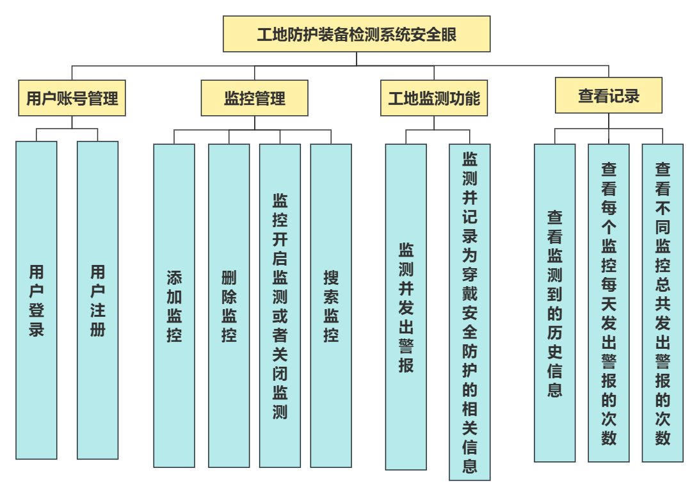

## （二）数据库设计

数据库设计如下面ER图所示，标红的为主键。

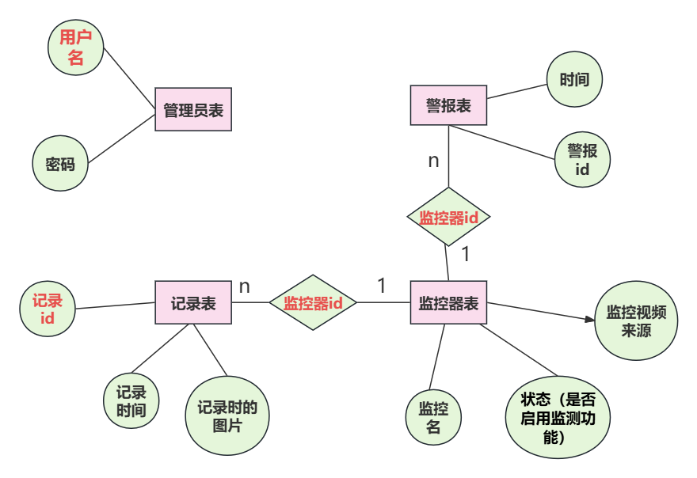

## （三）系统处理流程图

QT端

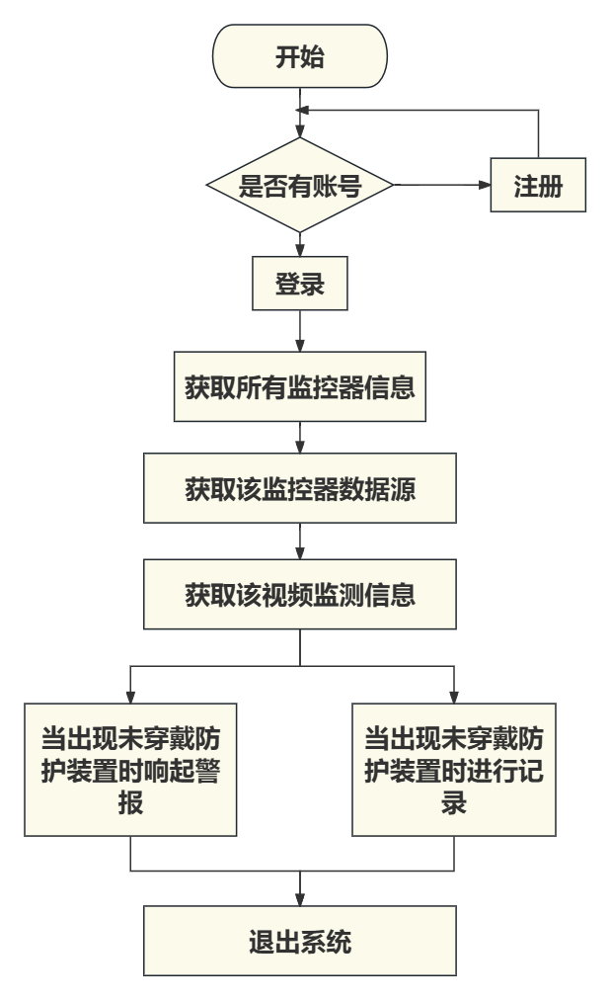

后台

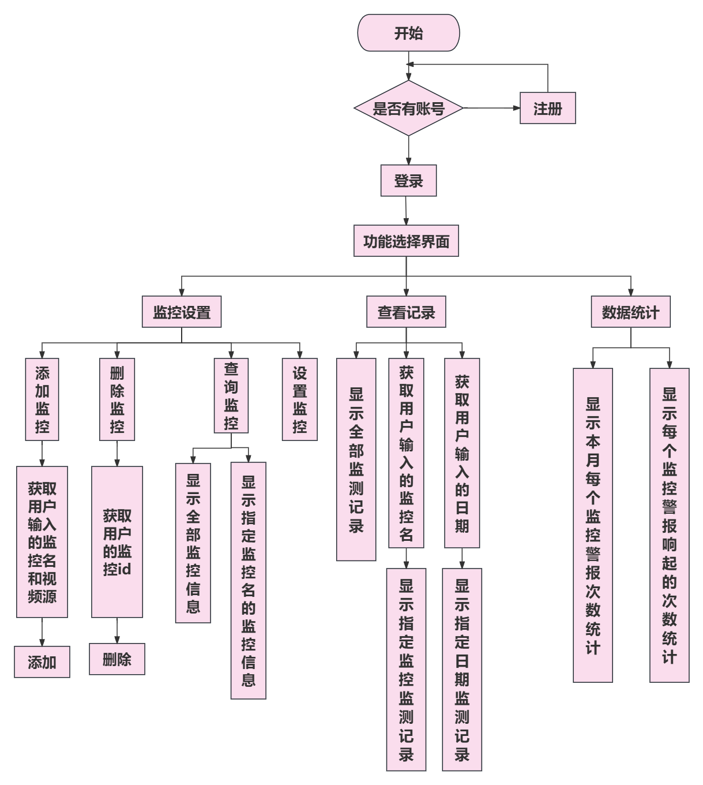

## （四）流程图（基于用户）

QT

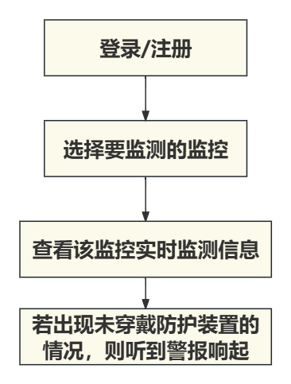

后台

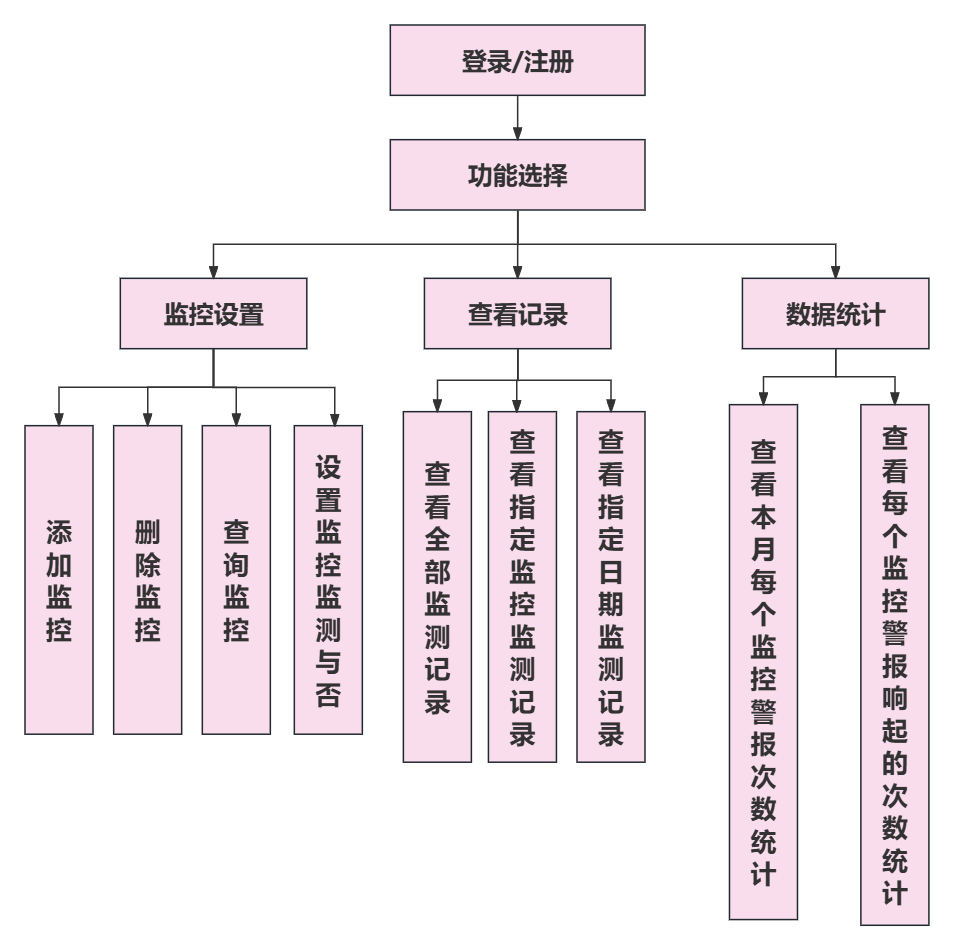

# 三、技术结构

## （一）技术框架

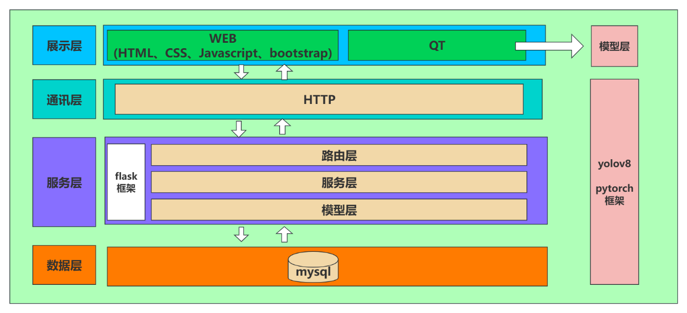

本项目采用双端作为展示层。WEB端主要进行数据的增删查改，为节省视频和图像在网络上的传输时间浪费，因此，监控界面使用了QT。QT端将视频抽帧后将直接调用模型进行数据交互，并将结果展示到界面上。

通讯层使用HTTP协议进行通信。

服务端使用flask框架，在路由层获取到请求之后，再调用相应的服务层的处理函数，服务层再通过模型层进行数据库的增删改查。

 ## （二）模型调用

选择YOLOv8作为目标检测模型，用于识别图像中的人员是否佩戴安全帽和反光服。在Python环境中使用PyTorch深度学习框架加载预训练的YOLOv8模型。模型调用实现在PyQt5里，负责对上传的视频进行目标检测。

## （三）前端设计

技术选型：PyQt5框架+Web前端（HTML、CSS、JavaScript和Bootstrap）

1. PyQt5框架：实现用户登录注册功能，获取监控名称供用户选择，实现实时监控播放，同时将每次的检测记录展示在界面并返回给后端。
2. Web前端：实现监控设置（添加、删除、查询、设置）、显示全部检测记录、显示指定日期的监测记录，本月每个监控警报次数的统计和每个监控警报响起的次数统计等功能。

## （四）后端处理

1. Flask框架：处理HTTP请求和响应。设计清晰、高效的API接口，使用JSON格式进行数据交换

2. 数据库交互：使用SQLAlchemy来实现与数据库的交互。

## （五）数据处理

接收图像后，使用OpenCV库进行预处理，包括调整大小、归一化、通道顺序转换等，以便模型能够接受的格式。

# 四、数据集

## （一）数据量

数据集分为4个类别，共330张包含不同场景下的照片或视频帧，显示人员是否穿戴了安全帽和反光服。

## （二）类别个数

数据集分成4种类别，具体为安全穿戴、未佩戴头盔、未穿反光服、既未佩戴头盔、又未穿反光服。

## （三）数据标注

数据都是我们自己手动标注的，不过我们只标记了上半身体。

# 五、使用模型

我们使用的是yolov8的预训练模型进行模型的训练。

yolov8模型如何放在云服务器上，可以看我写的文章[将yolov8预训练模型放在云服务器上训练-CSDN博客](https://blog.csdn.net/weixin_62300611/article/details/140911901?spm=1001.2014.3001.5501)

# 六、运行效果图

## （一）QT前端界面

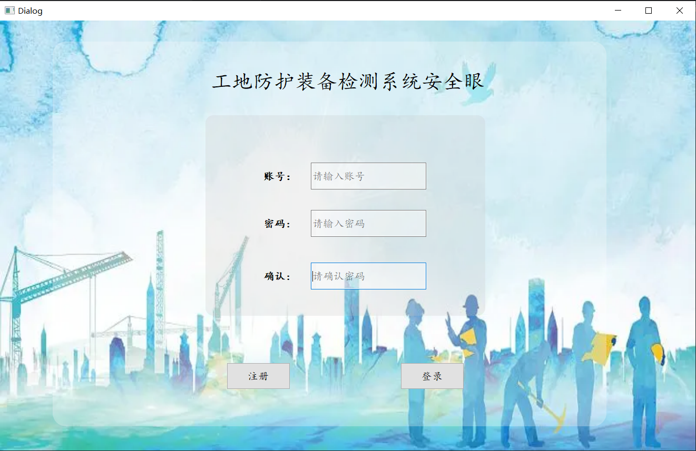

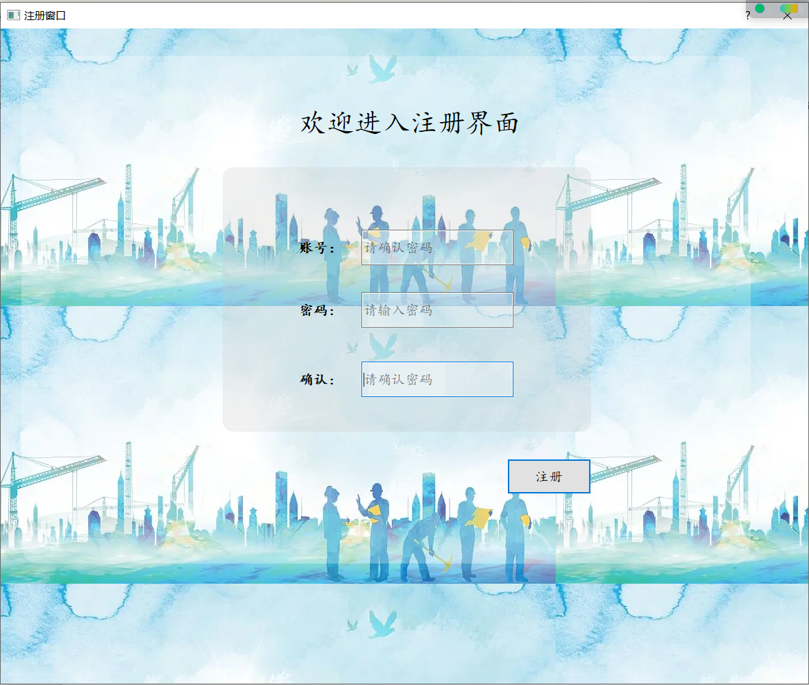

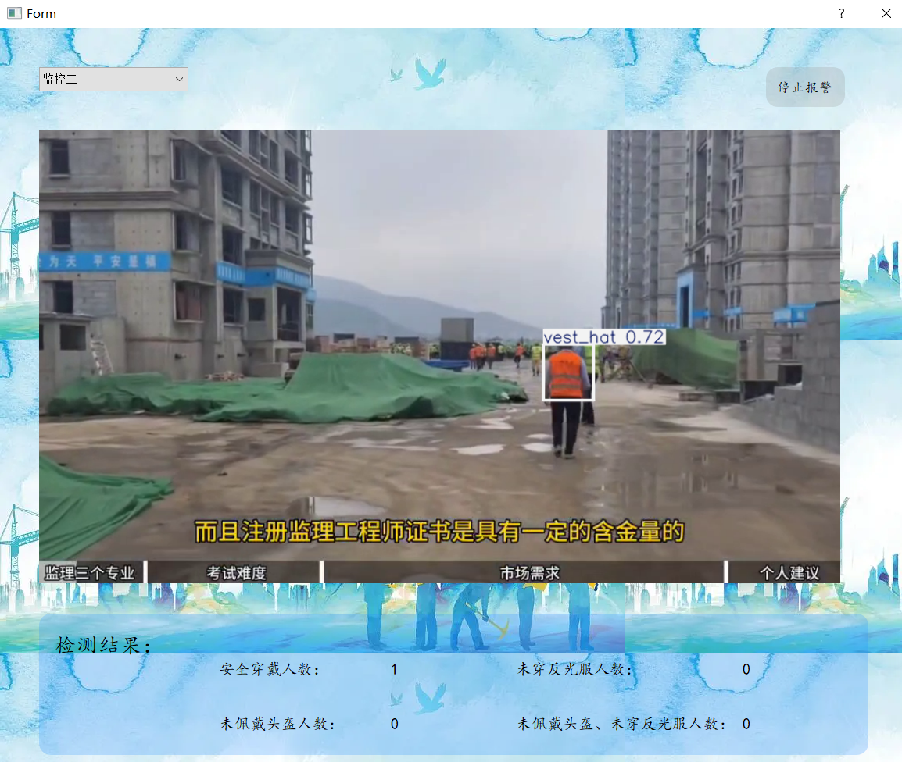

## （二）前端Web界面

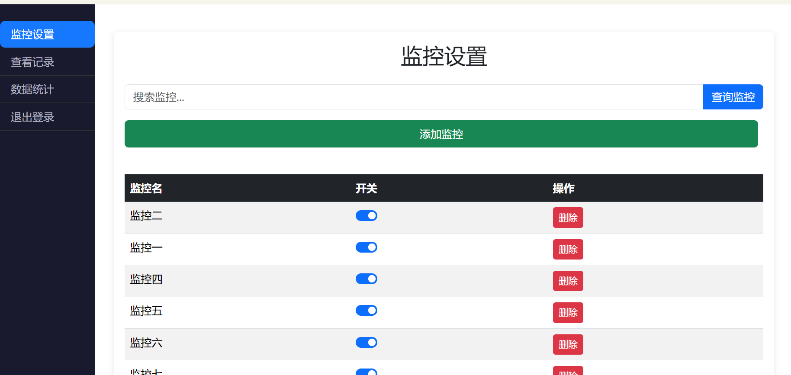

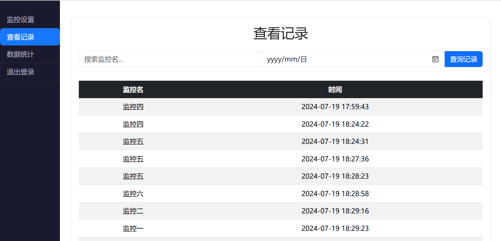

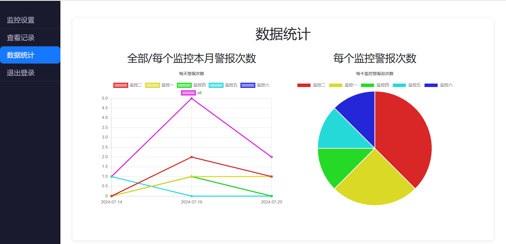

# 七、项目运行

## （一） 后台运行

后台直接点击可能会出错。

如果使用的是vscode的话，需要Live server插件。

然后点击想要启动的界面，右键，选择Open with live server 才能正常运行。

其中 index是主页。项目应该从login.html开始运行才对。

## （二） 后端运行

后端的数据库配置需要在/config/config.py里修改。具体变量含义已在代码中注释。

## （三） QT和后端

QT中的接口ip写的都是127.0.0.1，因此如果后端和QT不在同一个电脑上，非常抱歉，需要逐一修改。可以搜索5000，亲测可以查到所有发起请求的url。

## （四） 模型相关资料

在/ultralytics目录下，包含数据集、最优的模型训练代码及模型。